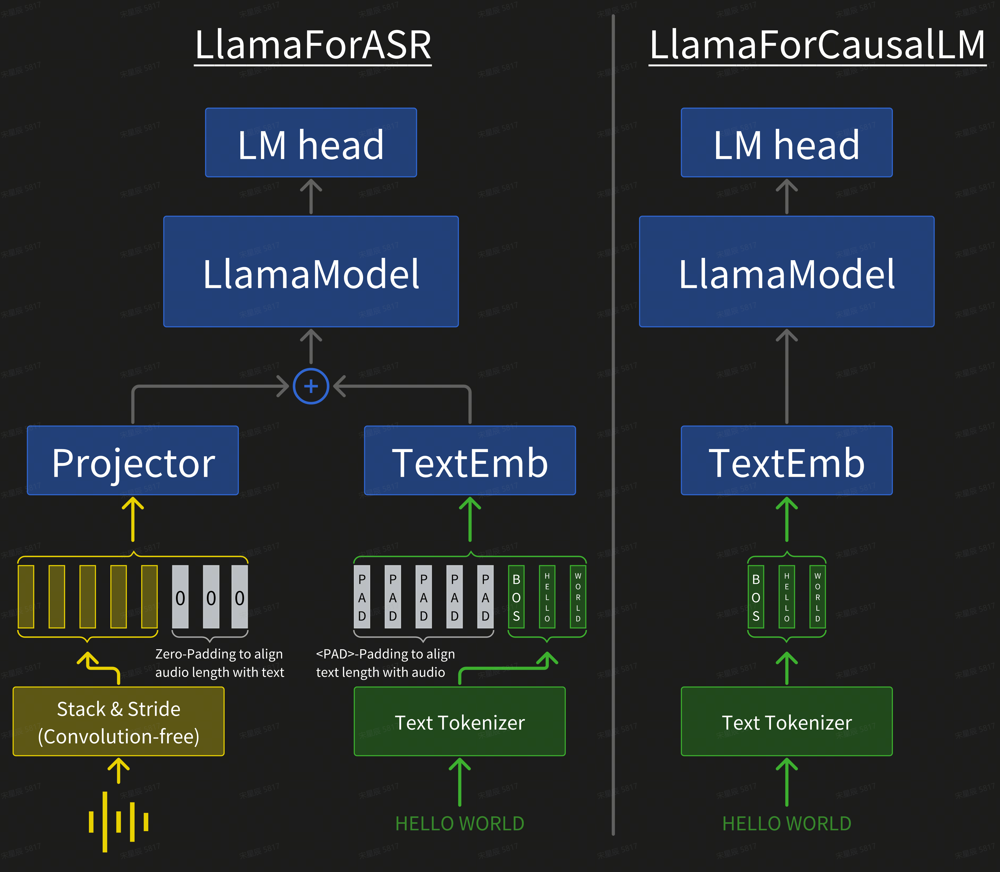

# Brief intro on our `LlamaForASR`

We will briefly introduce our new custom model for speech tasks, `LlamaForASR`. It is basically the same as `LlamaForCausalLM`, except that it has an additional simple projector (nn.Linear) to align the feature dimensions of speech and text.

The core principle of our design of `LlamaForASR` is **scaling**. `Every design is for better scaling`. For example:

1. **`Convolution-free Architecture`**: For a long time, in the field of speech recognition, conformer has always been a better structure than transformer, especially on small datasets. However, when you actually scale up conformer, it brings lots of challenges. First, the existence of convolution (in both the downsampling part and the main part of the model) will cause the parallel strategies commonly used in LLM (cp/sp, etc.) to not be directly reused. To build a giant conformer that supports longer input (let's say sequence length > 128K), you need a lot of system engineering. Second, inductive bias is a well-known problem in convolution and it may hurt performance when we aim to scale. Instead of following the experience design in the speech field, I would rather lose 1% of WER but replace conformer with transformer. Then we can reuse all the hardware benefits and all the ecosystem built for transformer.
2. **`N-D Parallel-friendly Inputs`**: Different from pure text LLM, multimodal models will have inputs of multiple modalities. Usually, the inputs of different modalities are spliced together by `concat` operation. However, concat is a very unfriendly operation for parallel strategies (especially context parallel). It breaks the assumption that all inputs have identical shape. To solve this problem, we use the `padding + addition strategy`. Specifically, in the data preprocessing stage, we will pad the data lengths of different modalities to the same. As shown in the figure above, the audio sequence will be padded with zero values at the end, and the text sequence will be padded with \<PAD\> symbols at the head. Our projector does not contain bias, so zero-in results in zero-out. After obtaining the sequence embeddings of different modalities with the same length, we obtain the final model input through a simple addition operation. We find this strategy simple but effective. We conduct experiments on wenetspeech (1w hours of training data). As shown in the figure below, our design **converges smoothly** and we can observe a **good scaling pattern** when comparing the 50M model with the 1B model. The final dev acc on the 1B model at 120K steps is around 93% and by comparing the subsequent acc curve of the 50M model, we can conclude that there will be at least a 2% acc improvement space if the 1B model is continued to be trained.

