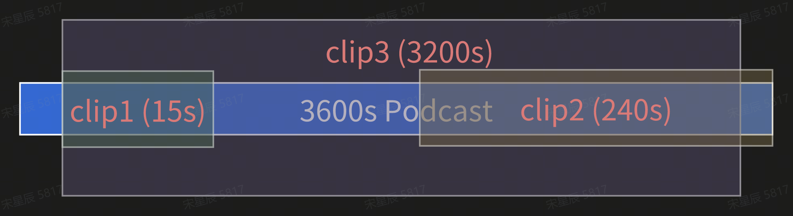
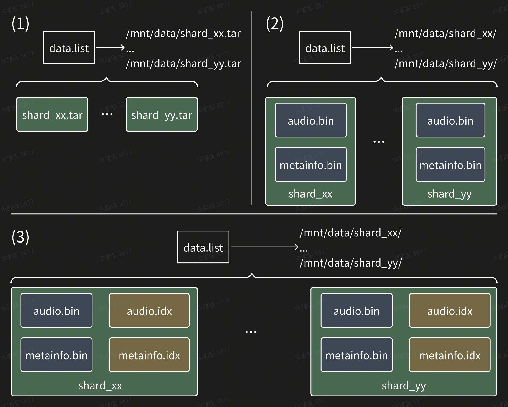
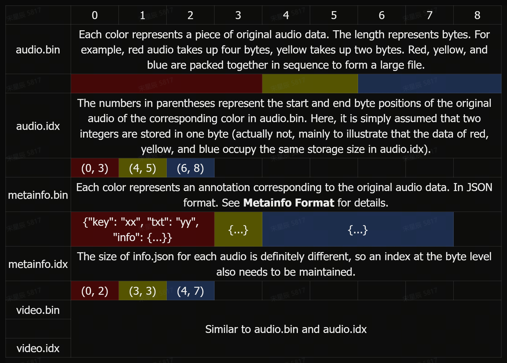
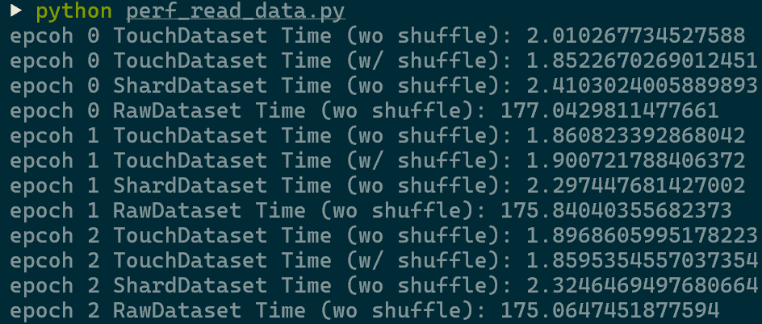

# Why TouchDataset?

## **1. Background**  

Legacy Format Issues:  

- **Raw Format** ([[WeNet.Raw]](https://github.com/wenet-e2e/wenet/blob/main/wenet/dataset/deprecated/processor.py#L126-L162), [[HuggingFace.Dataset]](https://huggingface.co/docs/datasets/access#dataset)): (1)👎Inefficient HDFS/JFS reads for small files. (2)👎Caused memory overflow due to oversized `data.json` with trillion entries;
- **Shard Format** ([[WeNet.Shard]](https://github.com/wenet-e2e/wenet/blob/main/wenet/dataset/deprecated/processor.py#L67-L123), [[HuggingFace.IterableDataset]](https://huggingface.co/docs/datasets/access#dataset)): (1)👍Solved above issues by packing data into tar files (which then partitioned into smaller chunks called shards). (2)👎Challenges when scaling shard format:
  - **Sequential-only I/O**: It lacks random access, which is crucial for dataloader resumption & global shuffling & multimodal data processing like time slicing in audio/video.
  - ​​​​**RawData-MetaData Coupling**: The mandatory bundling of raw data (e.g., audio/video) and metadata (e.g., annotation of audio/video) in single tar files forces full shard loading and copying when you just want to edit metadata.
  - **Storage Waste**: Individual packaging of same-source audio clips (e.g., splitting hour-long podcasts into overlapping short/long segments)  results in redundant data storage.

<div align="center">


three clips segmented from the same source will be treated as individual data and packed together in shard format.

</div>

---

## **2. What do we need when scaling (multimodal) data?**

1. **Random Access**:
   - Random data retrieval for fast dataloader resumption (e.g., when your training breaks down and you want to restore from that exact point, see figure below) and global data shuffling without additional [[ShuffleBuffer]](https://huggingface.co/docs/datasets/v3.5.0/en/stream#shuffle).
2. **Decoupled RawData-MetaData**:
   - Enable annotation updates (e.g., improved ASR transcripts or new event tags) without loading entire audio/video.
3. **On-the-fly Segmentation**:
   - Instead of segmenting audio/video offline and saving them independently, we do on-the-fly slicing (according to timestamp annotations) on raw audio/video to avoid redundancy.

<div align="center">


Screenshot from Meta's OPT Logs. When training their [OPT](https://ai.meta.com/blog/democratizing-access-to-large-scale-language-models-with-opt-175b/) models, Meta [reported](https://github.com/facebookresearch/metaseq/blob/main/projects/OPT/chronicles/OPT175B_Logbook.pdf) wasting thousands of GPU-hours replaying their data loading after crashes in order to resume training where they left off.

</div>

---

## **3. TouchDataset Format Design**  

<div align="center">



</div>

As illustrated in the above figure:

(1) This is the original shard format used in [[WeNet.Shard]](https://github.com/wenet-e2e/wenet/blob/main/wenet/dataset/deprecated/processor.py#L67-L123) where the tarfile contained everything: the data itself (e.g., recording or features) and the metadata manifest (e.g., transcripts).

(2) Decouple `shard_xx.tar` into `audio.bin` (raw data) and `metainfo.bin` (metadata) so that we can investigate the metadata without actually loading or iterating through the entire shard. This is basically the same format as in [[Lhotse.Shar]](https://github.com/lhotse-speech/lhotse?tab=readme-ov-file#tutorials). It meets the requirements of **Decoupled RawData-MetaData** and **On-the-fly Segmentation**. However, unfortunately, it does not support **Random Access**. Users still have to sequentially read data from the first item to the last item (packed in singal `audio.bin`).

(3) The final format proposed in `👆 TouchDataset`. Compared to (2), we additionally save an index file (stored as `.idx`) for both raw data and metadata, in which we record physical bytes offset for each item. This design enables O(1) lookup complexity while maintaining <2% storage overhead relative to original datasets.

- **File Structure**:
  - **`audio.bin`**: Concatenated binary of all raw audio (color blocks in the figure below represent distinct audio files).  
  - **`audio.idx`**: Byte offsets for each audio (e.g., `(0,3)` for red audio spanning bytes 0-3).  
  - **`metainfo.bin`**: JSON annotations (source URLs, multi-version texts, segmentation metadata).  
  - **`metainfo.idx`**: Byte indices for annotation data.  
  - **Other Modalities**: `video.bin` and `video.idx` follow the same structure.  
- **Metainfo Format**  

  - `key`: Unique audio/video identifier (e.g., absolute path).  
  - `txt`: Default text (concatenation of all segment texts).  
  - `info`: Includes source URL, audio/video properties, and segment details (start/end timestamps, Whisper/Paraformer transcripts).  
  - **Dynamic Merging**: Adjacent segments can be merged on-the-fly based on start/end times to simulate varied training durations.  
  - Example item in metainfo:

      ```json
      {
          "key": "BAC009S0002W0122",
          "wav": "/mnt/data/Aishell/train/S0002/BAC009S0002W0122.wav",
          "txt": "而对楼市成交抑制作用最大的限购",
          "sample_rate": 16000,
          "info": {
              "segments": [
                  {"start": 0.0, "end": 1.0, "txt": "而对"},
                  {"start": 1.0, "end": 2.0, "txt": "楼市"},
                  ...
              ],
              ...
              "xx": "yy"
          }
      }
      ```

<div align="center">



</div>

---

## **4. Performance Tests**  

We compare `👆 TouchDataset` with [[WeNet.Shard]](https://github.com/wenet-e2e/wenet/blob/main/wenet/dataset/deprecated/processor.py#L67-L123). The results below show that `👆 TouchDataset` not only supports **random reads**, but also is **10%-20% faster** than [[WeNet.Shard]](https://github.com/wenet-e2e/wenet/blob/main/wenet/dataset/deprecated/processor.py#L67-L123).  

<div align="center">



</div>

---

## **5. Conclusion**  

The new data format (called `👆 TouchDataset`) addresses 3 key challenges in section.2 through indexed storage (`data.bin` + `data_index.bin`). Performance benchmarks confirm superiority over legacy solutions.
